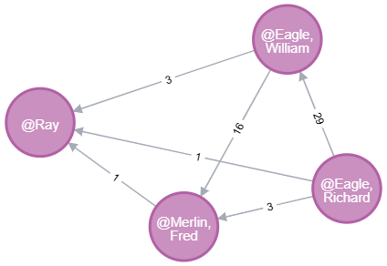

# Graph Analytics & Visualization Guide

> *How Neo4j transforms surveillance data into actionable intelligence through visual analytics*

## The Power of Graph Visualization

Traditional databases store relationships in tables. Graph databases **visualize** them. Here's what our surveillance network actually looks like:



*Real surveillance data showing communication patterns between suspects. Line thickness represents frequency (1-29 sessions).*

## Two Essential Questions for Any Investigation

### 1. "Who's at the center of this network?"

**The Challenge**: In a traditional database, finding influential people requires complex recursive queries with multiple JOINs that become exponentially slower as you search deeper.

**The Graph Solution**: One elegant query reveals communication hubs instantly.

```cypher
-- Find who can reach the most people within 3 degrees of separation
MATCH (person:Person)
WHERE person.name IN ['@Frasier, Owen', '@Eagle, William', '@Hawk, Kenzie', '@Merlin, Fred']
WITH person
MATCH (person)-[:USES|PARTICIPATED_IN*1..6]-(reached:Person)
WHERE reached <> person AND reached.name STARTS WITH '@'
RETURN 
  person.name as hub,
  COUNT(DISTINCT reached) as reach
ORDER BY reach DESC
```

**Real Results**:
- Kenzie Hawk: reaches 9 people
- William Eagle: reaches 8 people (key broker between Richard and Fred)
- Owen Frasier: reaches only 2 people (isolated)

### 2. "How are these two suspects connected?"

**The Challenge**: Finding hidden connections between people who never directly communicate would require 6+ JOIN operations in SQL, with performance degrading exponentially.

**The Graph Solution**: Shortest path algorithms reveal hidden connections instantly.

```cypher
-- Trace the connection between Beverly Eagle and Ray (who never directly communicate)
MATCH (person1:Person {name: '@Eagle, Beverly'}), (person2:Person {name: '@Ray'})
MATCH path = shortestPath((person1)-[:USES|PARTICIPATED_IN*..10]-(person2))
RETURN path
```

**What this reveals**: Beverly and Ray are connected through 6 hops via shared phone usage and communication sessions. In SQL, this query would be virtually impossible to write efficiently.

## Creating Your Own Weighted Visualizations

### Step 1: Generate the Network Graph

```cypher
-- Creates a clean person-to-person visualization with weighted edges
MATCH (p1:Person)-[:USES]->(c1)-[:PARTICIPATED_IN]->(s:Session)<-[:PARTICIPATED_IN]-(c2)<-[:USES]-(p2:Person)
WHERE p1.name IN ['@Eagle, Richard', '@Eagle, William', '@Merlin, Fred', '@Ray']
  AND p2.name IN ['@Eagle, Richard', '@Eagle, William', '@Merlin, Fred', '@Ray']
  AND p1.name < p2.name
WITH p1, p2, COUNT(DISTINCT s) as strength
WHERE strength > 0
CALL apoc.create.vRelationship(p1, 'COMMUNICATES', {strength: strength, weight: strength}, p2) YIELD rel
RETURN p1, rel, p2
```

### Step 2: Apply Visual Weight Styling

1. Run the query in Neo4j Browser (http://localhost:7474)
2. Click "COMMUNICATES" in the right sidebar under "Relationship types"
3. Select "strength" to display communication counts on edges

The result clearly shows:
- **Thick lines**: Heavy communication (Richard-William: 29 sessions)
- **Thin lines**: Minimal contact (Ray-Fred: 1 session)

### Step 3: Export Your Visualization

Click the download icon (↓) → "Export PNG" to save for reports.

## Why This Matters for Investigations

The visualization above immediately answers critical questions:

1. **William Eagle is the key broker** - He's the only connection between Richard Eagle and Fred Merlin
2. **Communication intensity varies dramatically** - From 29 sessions (Richard-William) to just 1 (Ray-Fred)
3. **Hidden patterns emerge** - Ray appears isolated but is actually connected to everyone through 1-3 intermediaries

In a traditional database, discovering these patterns would require:
- Complex stored procedures
- Multiple nested queries
- Hours of analysis
- Results in tabular format requiring mental visualization

In Neo4j, it's instant and visual.

## Quick Reference

### Login
- URL: http://localhost:7474
- Username: `neo4j`
- Password: `Sup3rSecur3!`

### Essential Commands
```bash
# Test your visualization queries
docker exec -i ${NEO_NAME} cypher-shell -u neo4j -p Sup3rSecur3! < queries/shortest-path-examples.cypher
```

### Export Tips
- Use PNG for documents (300 DPI)
- Enable "Curve relationships" for cleaner layouts
- Adjust physics controls to spread nodes optimally

---

*This guide demonstrates how graph databases transform raw communication data into visual intelligence that drives investigations forward.*