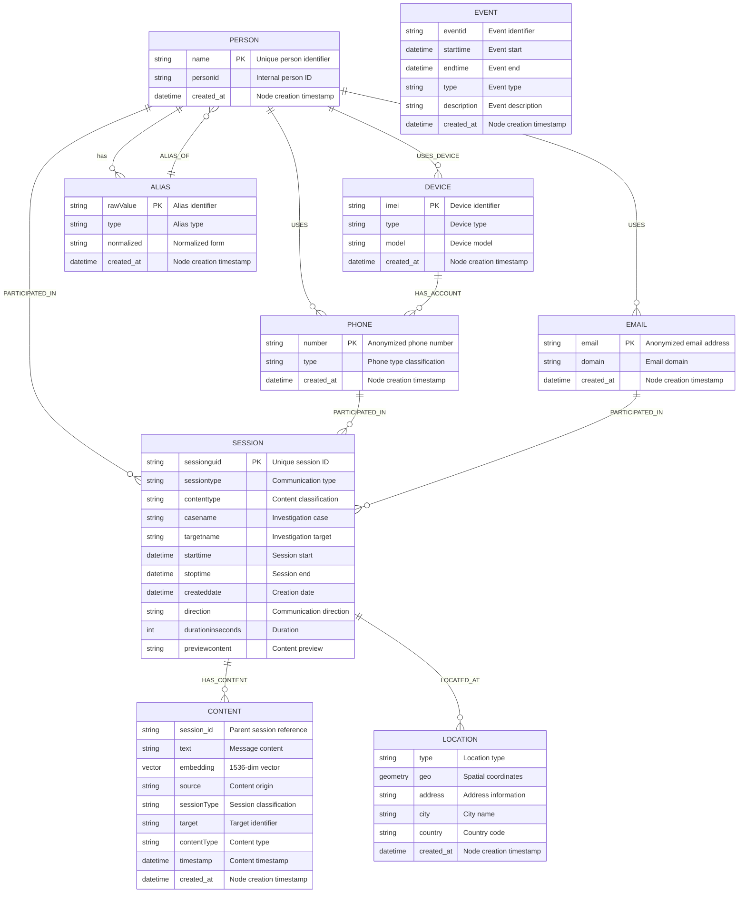

# Neo4j Graph Schema Guide

## Overview

This document describes the graph database schema used in the Neo4j Surveillance Analytics POC. The schema follows the **POLE model** (Person, Object, Location, Event), a standard framework used in law enforcement and intelligence analysis for organizing investigative data.

## Why Graph Databases for Surveillance Analytics?

Traditional relational databases struggle with complex relationship queries that are essential for investigation work:
- Finding connections between suspects
- Identifying communication patterns
- Discovering hidden networks
- Tracking information flow

Graph databases excel at these tasks because they store relationships as first-class citizens, making multi-hop queries and pattern detection extremely efficient.

## Schema Design Principles

1. **Session-Centric Architecture**: All communications are modeled as `Session` nodes, whether they're phone calls, messages, or social media interactions
2. **Content Separation**: Message content is stored separately in `Content` nodes with vector embeddings for semantic search
3. **Identity Resolution**: Multiple identifiers (phones, emails, aliases) are linked to `Person` nodes
4. **Temporal Awareness**: All entities include timestamps for time-based analysis
5. **Privacy by Design**: Personal information is anonymized while preserving analytical capabilities

## Entity-Relationship Diagram



*Note: The diagram above uses Entity-Relationship notation adapted for graph databases. While traditional ER diagrams were designed for relational databases, the notation effectively communicates the node types (entities) and their relationships in our graph model.*

**Data Volume Summary** (based on full dataset):
- **Total Nodes**: 275,121
- **Person**: 7,500 nodes
- **Session**: 100,286 nodes (67.8% Messaging, 20.3% Telephony, 6.7% Social Network)
- **Content**: 157,828 nodes with text and embeddings
- **Alias**: 8,168 alternative identifiers
- **Location**: 661 geographic points
- **Phone/Email/Device**: 678 communication endpoints

## Node Types (Entities)

### Person
Central entity representing individuals in the investigation.
- **Count**: 7,500 nodes
- **Key Properties**: name (anonymized), personid, created_at
- **Usage**: Core entity for network analysis and relationship mapping

### Communication Objects

#### Phone
Represents phone numbers used in communications.
- **Count**: 642 nodes
- **Key Properties**: number (anonymized), type, created_at
- **Usage**: Links persons to telephony and messaging sessions

#### Email
Represents email addresses.
- **Count**: 19 nodes
- **Key Properties**: email (anonymized), domain, created_at
- **Usage**: Links persons to email communications

#### Device
Represents physical devices (phones, computers).
- **Count**: 17 nodes
- **Key Properties**: imei, type, model, created_at
- **Usage**: Links devices to accounts and persons

### Session (Event)
Represents any communication event between persons.
- **Count**: 100,286 nodes
- **Key Properties**: sessionguid, sessiontype, starttime, duration
- **Types**: 
  - Messaging (67,950) - Text messages, chat apps
  - Telephony (20,392) - Voice calls
  - Social Network (6,747) - Social media interactions
  - Entity Report (4,310) - Investigation reports
  - Generic File (818) - Document exchanges
  - Others (69) - Email, Intel Reports, etc.

### Content
Stores the actual text/transcript of communications with embeddings.
- **Count**: 157,828 nodes
- **Key Properties**: text, embedding (1536-dimensional vector), source
- **Usage**: Enables semantic search and content analysis

### Location
Represents geographic locations associated with sessions.
- **Count**: 661 nodes
- **Key Properties**: geo coordinates, address, city, country
- **Usage**: Spatial analysis and movement tracking

### Alias
Alternative identifiers for persons (usernames, nicknames).
- **Count**: 8,168 nodes
- **Key Properties**: rawValue, type, normalized form
- **Usage**: Identity resolution and cross-platform tracking

## Relationships

### Primary Communication Flow
1. `(:Person)-[:PARTICIPATED_IN]->(:Session)` - Person participates in communication
2. `(:Phone|Email)-[:PARTICIPATED_IN]->(:Session)` - Identifier used in communication
3. `(:Session)-[:HAS_CONTENT]->(:Content)` - Session contains message content

### Identity Relationships
- `(:Person)-[:USES]->(:Phone|Email)` - Person uses identifier
- `(:Person)-[:USES_DEVICE]->(:Device)` - Person uses device
- `(:Device)-[:HAS_ACCOUNT]->(:Phone)` - Device has phone account
- `(:Alias)-[:ALIAS_OF]->(:Person)` - Alias belongs to person

### Spatial Relationships
- `(:Session)-[:LOCATED_AT]->(:Location)` - Communication occurred at location

## Key Patterns for Investigation

### 1. Find All Communications Between Two Persons
```cypher
// Example: Find all sessions between two specific persons
MATCH (p1:Person)-[:PARTICIPATED_IN]->(s:Session)<-[:PARTICIPATED_IN]-(p2:Person)
WHERE p1.name = 'Person_A' AND p2.name = 'Person_B'
RETURN s.sessiontype, s.starttime, s.durationinseconds
ORDER BY s.starttime DESC
LIMIT 20
```

### 2. Discover Communication Networks
```cypher
// Example: Find a person's frequent contacts (>1000 interactions)
MATCH (p:Person)-[:PARTICIPATED_IN]->(s:Session)<-[:PARTICIPATED_IN]-(other:Person)
WHERE p.name = 'Target_Person' AND p <> other
WITH other.name as contact, count(DISTINCT s) as interactions
WHERE interactions > 1000
RETURN contact, interactions
ORDER BY interactions DESC
```

### 3. Semantic Content Search
```cypher
// Note: This requires generating an embedding vector first
// Example using text search as a practical alternative:
CALL db.index.fulltext.queryNodes('ContentFullText', 'suspicious keywords')
YIELD node, score
WHERE score > 1.0
MATCH (s:Session)-[:HAS_CONTENT]->(node)
MATCH (p:Person)-[:PARTICIPATED_IN]->(s)
RETURN substring(node.text, 0, 100) as snippet, s.starttime, count(DISTINCT p) as participant_count, score
ORDER BY score DESC
LIMIT 10
```

### 4. Timeline Analysis
```cypher
// Find recent sessions for persons matching a pattern
MATCH (p:Person)-[:PARTICIPATED_IN]->(s:Session)
WHERE p.name STARTS WITH 'Person_'  // or use pattern matching
AND s.starttime >= datetime('2022-01-01')
RETURN p.name, s.sessiontype, s.starttime, s.durationinseconds
ORDER BY s.starttime DESC
LIMIT 20
```

## Data Statistics Summary

| Entity Type | Count | Primary Use |
|------------|-------|-------------|
| Person | 7,500 | Network analysis |
| Session | 100,286 | Communication events |
| Content | 157,828 | Semantic search |
| Alias | 8,168 | Identity resolution |
| Location | 661 | Spatial analysis |
| Phone | 642 | Contact identification |
| Email | 19 | Contact identification |
| Device | 17 | Device tracking |

| Relationship Type | Count | Purpose |
|------------------|-------|---------|
| PARTICIPATED_IN | 714,085 | Links persons/identifiers to sessions |
| HAS_CONTENT | 171,709 | Links sessions to content |
| LOCATED_AT | 26,383 | Spatial context |
| ALIAS_OF | 8,180 | Identity mapping |
| USES | 660 | Person-identifier mapping |
| HAS_ACCOUNT | 23 | Device-account mapping |
| USES_DEVICE | 20 | Person-device mapping |

## Privacy and Security Considerations

This schema is designed with privacy in mind:
- All personal identifiers (names, phones, emails) are anonymized
- Content is separated from metadata for access control
- Timestamps allow for data retention policies
- The schema supports role-based access control at the query level

## Performance Considerations

1. **Indexes**: Vector index on Content.embedding for semantic search
2. **Constraints**: Unique constraints on primary identifiers
3. **Relationship Weights**: Session relationships can include interaction counts
4. **Time-based Partitioning**: Sessions can be partitioned by date for large datasets

## Future Enhancements

Potential schema extensions:
- Group/Organization nodes for criminal organization mapping
- Evidence nodes for digital forensics integration
- Case nodes for multi-investigation management
- Alert nodes for real-time monitoring scenarios

---

*This schema provides a flexible foundation for law enforcement analytics while maintaining privacy and enabling powerful graph-based investigations.*